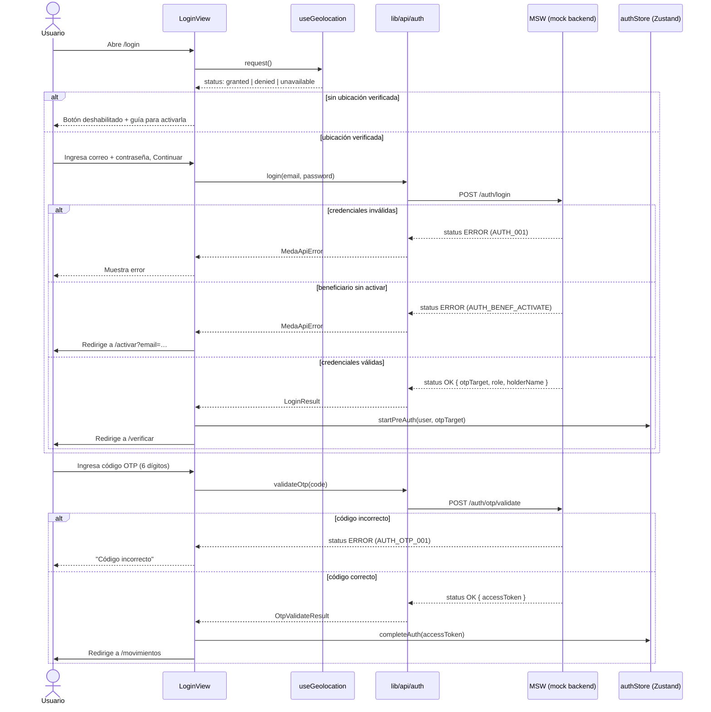
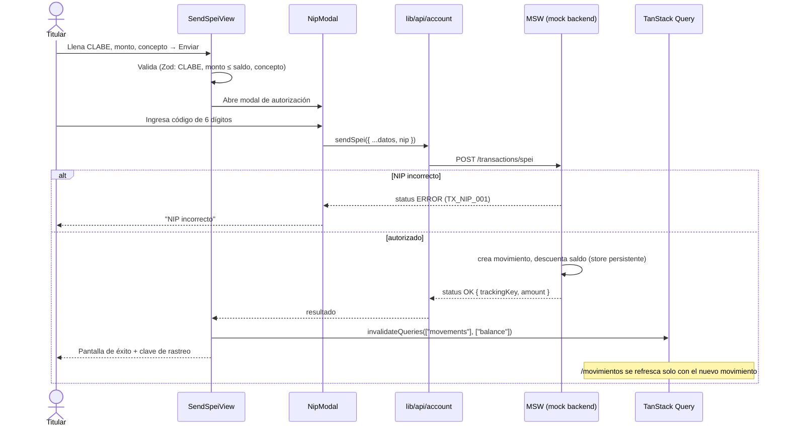
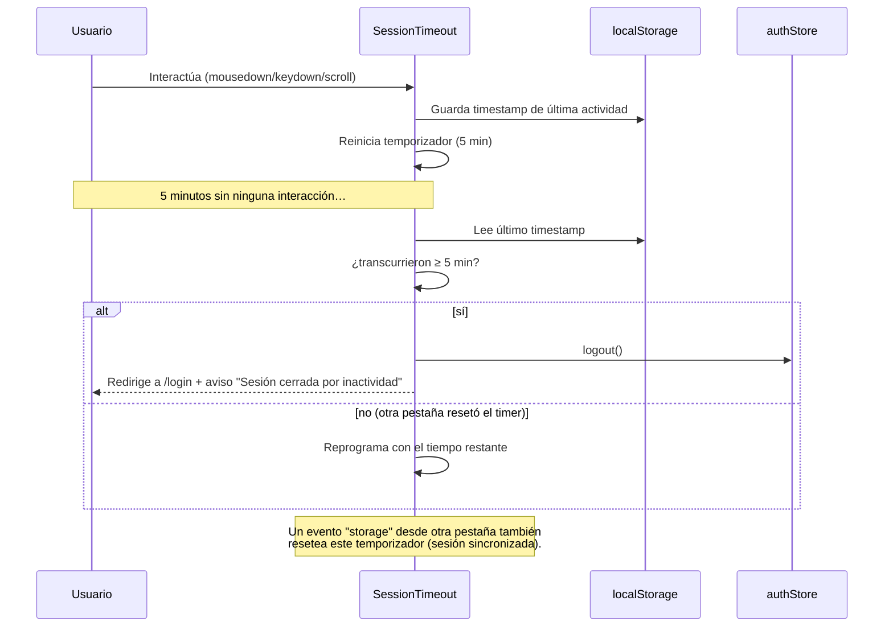

# Medá · Plataforma Web Persona Física

Plataforma web de banca digital para **personas físicas** de Medá: inicio de sesión con verificación
en dos pasos, movimientos y saldo, transferencias SPEI, estados de cuenta descargables en PDF, gestión
de perfil y un flujo regulatorio de **beneficiarios y sucesión** (herencia de la cuenta).

Construida siguiendo los estándares de frontend de Medá (Next.js 16 App Router + TypeScript +
Tailwind), con **MSW** simulando el backend mientras los endpoints reales no existen.

> Este documento explica qué hace la plataforma, cómo está construida, las decisiones de arquitectura
> y seguridad, y cómo correrla y probarla de punta a punta.

---

## Tabla de contenido

1. [Stack técnico](#1-stack-técnico)
2. [Cómo empezar](#2-cómo-empezar)
3. [Scripts disponibles](#3-scripts-disponibles)
4. [Variables de entorno](#4-variables-de-entorno)
5. [Arquitectura del proyecto](#5-arquitectura-del-proyecto)
6. [Mocking con MSW: cómo y por qué](#6-mocking-con-msw-cómo-y-por-qué)
7. [Contrato de API (envelope MEDA)](#7-contrato-de-api-envelope-meda)
8. [Estado y datos](#8-estado-y-datos)
9. [Seguridad y buenas prácticas aplicadas](#9-seguridad-y-buenas-prácticas-aplicadas)
10. [Casos de uso](#10-casos-de-uso)
11. [Diagramas de secuencia](#11-diagramas-de-secuencia)
12. [Credenciales y códigos de prueba](#12-credenciales-y-códigos-de-prueba)
13. [Despliegue](#13-despliegue)
14. [Cuando llegue el backend real](#14-cuando-llegue-el-backend-real)

---

## 1. Stack técnico

| Capa | Elección | Por qué |
|---|---|---|
| Framework | **Next.js 16** (App Router, Turbopack) | Estándar Medá; Server/Client Components, rutas por carpetas |
| Lenguaje | **TypeScript** | Tipado en API, formularios y contratos de datos |
| Estilos | **Tailwind CSS 4** + tokens MEDA UI (`meda-tokens.css`) | Sistema de diseño Binance-style, dark mode nativo |
| Formularios | **React Hook Form + Zod** | Validación declarativa y tipada, integrada con `@hookform/resolvers` |
| Estado de sesión | **Zustand** (con `persist` en `sessionStorage`) | Estado global pequeño; ver [sección 8](#8-estado-y-datos) |
| Datos remotos | **TanStack Query** | Cache, invalidación, estados de carga/error uniformes |
| Mocking | **MSW (Mock Service Worker)** | Intercepta a nivel de red; ver [sección 6](#6-mocking-con-msw-cómo-y-por-qué) |
| Iconos | **lucide-react** | Set de íconos consistente con el resto de apps Medá |
| Gestor de paquetes | **pnpm** (`pnpm@11.8.0` fijo en `packageManager`) | Reproducibilidad; versiones exactas, sin `^`/`~` |

## 2. Cómo empezar

```bash
pnpm install

# Desarrollo (MSW activo por defecto en dev)
pnpm dev
# → http://localhost:3000
```

Al abrir la app en desarrollo, MSW arranca automáticamente (no requiere configuración) y toda la
plataforma funciona con datos simulados: no necesitas backend, base de datos ni variables de entorno
para probarla localmente.

## 3. Scripts disponibles

| Script | Qué hace |
|---|---|
| `pnpm dev` | Servidor de desarrollo (Turbopack), con recarga en caliente |
| `pnpm build` | Build de producción (modo servidor) |
| `pnpm start` | Sirve el build de producción (requiere `pnpm build` antes) |
| `pnpm lint` | ESLint sobre todo el proyecto |
| `pnpm dev:tunnel` | Expone `localhost:3000` con `cloudflared` (para compartir una URL de revisión) |

Build para **export estático** (por ejemplo, Netlify Drop o cualquier hosting estático), ver
[sección 13](#13-despliegue):

```bash
STATIC_EXPORT=true NEXT_PUBLIC_ENABLE_MSW=true pnpm build
# genera ./out
```

## 4. Variables de entorno

No se requiere ningún `.env` para desarrollar: los defaults ya activan MSW en dev y apuntan a una base
de API vacía (todas las peticiones las intercepta el mock). Documentadas para cuando se necesiten:

| Variable | Default efectivo | Uso |
|---|---|---|
| `NEXT_PUBLIC_API_URI_BASE` | `""` (vacío) | Prefijo de las rutas de API reales (`lib/api/client.ts`). En vacío, las rutas son relativas y MSW las intercepta igual. |
| `NEXT_PUBLIC_ENABLE_MSW` | `true` en dev, `false` en producción | Fuerza encender/apagar MSW. `"true"` explícito lo activa incluso en un build de producción (usado para el export estático de revisión/demo). `"false"` explícito lo apaga en dev. |

**Ninguna variable contiene secretos.** Ver [sección 9](#9-seguridad-y-buenas-prácticas-aplicadas).

## 5. Arquitectura del proyecto

```
src/
├── app/                          # Next.js App Router — solo rutas y layouts
│   ├── login/                    # /login (pública)
│   ├── verificar/                # /verificar — OTP tras login
│   ├── activar/                  # /activar — onboarding del beneficiario
│   ├── sucesion/                 # /sucesion — activar protocolo de sucesión (por URL)
│   ├── restablecer/              # /restablecer — reinicia el estado mock (solo dev/demo)
│   └── (app)/                    # Grupo de rutas AUTENTICADAS (con sidebar + topbar)
│       ├── layout.tsx            #   guard de sesión + AppShell + SessionTimeout
│       ├── movimientos/
│       ├── estados-de-cuenta/[id]/
│       ├── transacciones/{enviar-spei,recibir-spei,entre-cuentas}/
│       ├── perfil/
│       ├── beneficiario/
│       ├── cancelar/
│       └── notificaciones/
│
├── features/                     # Lógica y UI por dominio (un feature = una carpeta)
│   ├── auth/                     #   login, OTP, onboarding beneficiario, sucesión
│   ├── movements/                #   tabla de movimientos, detalle, CEP
│   ├── transactions/              #   enviar SPEI, entre cuentas, modal de NIP
│   ├── account-statements/       #   listado + documento imprimible (PDF)
│   ├── profile/                  #   ver/editar datos, cambiar NIP
│   ├── beneficiary/               #   alta/edición/baja de beneficiarios
│   ├── account/                  #   cancelación de cuenta
│   ├── security/                 #   NipDialog reutilizable (autorización)
│   └── shell/                    #   menú de usuario, notificaciones, inactividad
│
├── components/
│   ├── ui/                       # Librería MEDA UI (Button, DataTable, DetailModal, Sidebar, …)
│   ├── providers/                # MSWProvider, QueryProvider, AppProviders
│   └── icons/
│
├── lib/
│   ├── api/                      # Clientes tipados por dominio (auth.ts, account.ts, profile.ts, client.ts)
│   ├── hooks/                    # Hooks de TanStack Query (use-account.ts, use-profile.ts)
│   ├── stores/                   # Zustand (auth-store.ts)
│   └── utils/                    # format, validators, mask, cn
│
├── mocks/                        # MSW — el "backend" simulado
│   ├── handlers/                 #   auth.ts, account.ts, profile.ts (uno por dominio)
│   ├── data.ts                   #   datos semilla + generadores
│   ├── store.ts                  #   estado mutable persistente (localStorage)
│   └── browser.ts / enabled.ts   #   arranque del worker + flag de activación
│
└── styles/                       # meda-tokens.css (design tokens), transitions.css
```

**Regla de oro de la estructura:** `app/` solo enruta (páginas delgadas que renderizan un componente de
`features/`); toda la lógica de negocio, estado local y UI compuesta vive en `features/`. Esto permite
reutilizar la misma vista desde distintas rutas y facilita las pruebas.

## 6. Mocking con MSW: cómo y por qué

El backend de persona física **no existe todavía**. En vez de hardcodear respuestas dentro de los
componentes (`if (fake) return {...}`), usamos **MSW (Mock Service Worker)**, que intercepta las
peticiones **a nivel de red** — el código de la app llama a la ruta real (`/auth/login`,
`/account/movements`, …) sin saber que existe un mock:

```
Componente → hook (TanStack Query) → lib/api/*.ts (fetch a ruta real)
                                            │
                                    (en dev/demo) MSW intercepta aquí, en el navegador
                                            │
                                    responde con el mismo contrato que dará el backend real
```

**Por qué importa:** el día que el backend esté listo, se apaga MSW con una variable de entorno
(`NEXT_PUBLIC_ENABLE_MSW=false`) y **no se toca ni una línea de `lib/api` ni de los componentes** —
nunca hubo código de mock mezclado con código de producción que haya que encontrar y borrar.

**Dónde vive cada cosa:**
- `src/mocks/handlers/*.ts` — un archivo por dominio (`auth`, `account`, `profile`), cada uno con sus
  `http.get/post/patch/delete`, devolviendo el [envelope real](#7-contrato-de-api-envelope-meda).
- `src/mocks/data.ts` — datos semilla (167 movimientos generados, catálogo de bancos, perfil por
  defecto) y funciones que generan movimientos nuevos (p. ej. al enviar un SPEI).
- `src/mocks/store.ts` — el único lugar con **estado mutable**: persiste en `localStorage`
  (`meda-pf-mock-state`) para que decisiones como "activar sucesión" o "dar de alta un beneficiario"
  **sobrevivan a un refresh** y se comporten como cambios reales, no como una animación de UI.
- `src/components/providers/msw-provider.tsx` — arranca el *service worker* del navegador antes de
  renderizar la app (evita que una petición salga antes de que el mock esté listo) y no bloquea la UI
  si el worker falla en arrancar.

**Endpoints simulados actualmente:**

| Dominio | Método y ruta | Qué hace |
|---|---|---|
| Auth | `POST /auth/login` | Valida credenciales (titular o beneficiario), dispara OTP |
| Auth | `POST /auth/otp/request` | Reenvía el código |
| Auth | `POST /auth/otp/validate` | Confirma el OTP → entrega tokens de sesión |
| Auth | `POST /auth/nip/validate` | Autoriza una acción sensible con el código actual |
| Auth | `POST /auth/nip/change` | Cambia el NIP (valida el actual) |
| Auth | `POST /auth/beneficiary/start` | Onboarding: valida elegibilidad del beneficiario, envía OTP |
| Auth | `POST /auth/beneficiary/activate` | Onboarding: define contraseña + NIP → sesión |
| Auth | `POST /auth/logout` | Cierra sesión |
| Cuenta | `GET /account/balance` | Saldo y datos de la cuenta |
| Cuenta | `GET /account/movements` | Movimientos con filtros (clave de rastreo, rango de fechas) |
| Cuenta | `GET /account/movements/:id` | Detalle de un movimiento |
| Cuenta | `GET /account/movements/:id/cep` | Comprobante Electrónico de Pago |
| Cuenta | `GET /account/statements` | Periodos de estado de cuenta disponibles |
| Cuenta | `POST /transactions/spei` | Envía un SPEI (requiere NIP), genera un movimiento nuevo |
| Perfil | `GET /account/profile` | Perfil + estado de cuenta + lista de beneficiarios |
| Perfil | `PATCH /account/profile` | Actualiza correo/teléfono/RFC |
| Beneficiario | `GET / POST /account/beneficiary` | Lista / alta de beneficiarios |
| Beneficiario | `PATCH /account/beneficiary/:id` | Edición |
| Beneficiario | `DELETE /account/beneficiary/:id` | Baja |
| Sucesión | `POST /account/succession/request` | Activa el protocolo por correo del titular (flujo externo) |
| Cuenta | `POST /account/cancel` | Cancela la cuenta (requiere NIP + CLABE destino) |
| Demo | `POST /demo/reset` | Reinicia el estado mock a sus valores iniciales |

## 7. Contrato de API (envelope MEDA)

Todas las llamadas usan el mismo sobre (`lib/api/client.ts`), igual que los servicios Java de Medá:

```ts
// Petición (POST/PATCH/DELETE)
{ "traceId": "uuid-generado", "body": { /* payload */ } }

// Respuesta
{ "status": "OK" | "ERROR", "errorCode": string | null, "errorMessage": string | null, "data": T }
```

`get/post/patch/del` en `lib/api/client.ts` desenvuelven la respuesta automáticamente: si
`status === "ERROR"` lanzan `MedaApiError(errorCode, errorMessage)`, que los componentes capturan para
mostrar el mensaje al usuario. Nunca se inspecciona `response.ok` de HTTP para decidir éxito/error —
MEDA usa **HTTP 200 con `status: "ERROR"`** para errores de negocio (credenciales inválidas, NIP
incorrecto, etc.), y reserva `>=500` para errores de infraestructura.

## 8. Estado y datos

- **Sesión de usuario** → Zustand (`lib/stores/auth-store.ts`), persistido en `sessionStorage` (se
  limpia al cerrar la pestaña/navegador, no en `localStorage`, para no dejar sesión "colgada"
  indefinidamente en un dispositivo compartido). Guarda `preAuth` (credenciales validadas, esperando
  OTP) y `user` (sesión completa), diferenciando rol `HOLDER` (titular) vs `BENEFICIARY`.
- **Datos remotos** (saldo, movimientos, perfil, estados de cuenta) → TanStack Query. Cada mutación
  relevante (enviar SPEI, cambiar perfil, dar de alta un beneficiario) invalida las queries afectadas
  (`["balance"]`, `["movements"]`, `["profile"]`) para que la UI se refresque sola, sin manejar estado
  duplicado a mano.
- **No hay Redux**: el alcance de estado global de esta app (sesión + cache de red) no lo justifica;
  Zustand + TanStack Query cubren el 100% de los casos. Ver estándar `fe-state-management`.

## 9. Seguridad y buenas prácticas aplicadas

Checklist real, verificado en este repo (no aspiracional):

- ✅ **Sin secretos en el cliente.** Las únicas variables `NEXT_PUBLIC_*` son configuración pública
  (URL base de API, flag de mocking) — nunca tokens ni llaves.
- ✅ **Sin `console.*` en código de producto** (solo en páginas de referencia `/showcase`,
  `/components`, que documentan la librería UI y no forman parte del flujo de negocio).
- ✅ **Sin `any` / `as any`** en el código de la aplicación — todo tipado de punta a punta (API,
  formularios, store).
- ✅ **`dangerouslySetInnerHTML`** usado una sola vez, para inyectar un script estático (detección de
  tema oscuro/claro antes del primer render) — sin datos de usuario ni de terceros.
- ✅ **Validación de input con Zod** en todos los formularios (login, SPEI, beneficiario, perfil), más
  validadores de dominio mexicano (`isValidCLABE`, `isValidRFC`, `isValidCURP`, `isValidEmail`,
  `isValidPhoneMX`) reutilizables en `lib/utils/validators.ts`.
- ✅ **Autorización explícita en acciones sensibles**: enviar SPEI, cambiar correo/teléfono/NIP, ver o
  descargar un estado de cuenta, dar de alta/editar/dar de baja un beneficiario y cancelar la cuenta
  requieren **confirmar con un código de 6 dígitos** (`NipDialog` / `NipModal`) antes de ejecutarse.
  Ninguna de estas acciones se dispara solo con un clic.
- ✅ **Versiones de dependencias exactas** (sin `^`/`~`) y lockfile (`pnpm-lock.yaml`) comprometido —
  una actualización de una dependencia nunca ocurre "sola" en un `pnpm install`.
- ✅ **`packageManager` fijado** (`pnpm@11.8.0`) para reproducibilidad entre máquinas/CI.
- ✅ **MSW nunca corre en producción** salvo activación explícita (usada únicamente para builds de
  demo/revisión sin backend), y su código vive fuera de `lib/api` y de los componentes — ver
  [sección 6](#6-mocking-con-msw-cómo-y-por-qué).
- ✅ **Sesión en `sessionStorage`**, no en `localStorage` (se pierde al cerrar el navegador).
- ✅ **Cierre de sesión por inactividad** (5 minutos) — ver [caso de uso 9](#caso-9--cierre-de-sesión-por-inactividad).
- ✅ **Geolocalización obligatoria** para iniciar sesión (requisito regulatorio IFPE) — no se puede
  entrar sin ubicación verificada. Ver [caso de uso 10](#caso-10--geolocalización-obligatoria-en-el-login).
- ✅ **Accesibilidad básica**: estados de error anunciados junto a cada campo, foco visible, botones
  con `aria-label` donde no hay texto visible (copiar, cerrar modal, menú).

## 10. Casos de uso

#### Caso 1 — Iniciar sesión con verificación en dos pasos
El titular ingresa correo y contraseña. Si son válidas, se envía un **código de un solo uso por
correo** (OTP); solo tras confirmarlo se otorga la sesión. Sin ubicación verificada, el botón de
inicio de sesión permanece deshabilitado (ver caso 10).

#### Caso 2 — Consultar movimientos con filtros
El titular ve su saldo, el total de registros y una tabla de movimientos filtrable por **clave de
rastreo** y **rango de fechas**. Cada fila permite **Ver detalle** (modal con ordenante/beneficiario,
comisión, IVA) y desde ahí **Ver CEP** (comprobante con sello digital), todo sin salir de la página.

#### Caso 3 — Enviar SPEI (a terceros o entre cuentas propias)
Formulario con validación de CLABE (18 dígitos), banco, monto contra saldo disponible y concepto. Antes
de ejecutar la transferencia se solicita el **código de 6 dígitos** de autorización. Al confirmar, el
movimiento aparece de inmediato en la lista y el saldo se actualiza (invalidación de queries).

#### Caso 4 — Recibir SPEI
Pantalla con los datos bancarios de la cuenta (CLABE, banco, titular) listos para copiar y compartir.

#### Caso 5 — Estados de cuenta como PDF
Lista de periodos disponibles. **Ver** y **Descargar** piden primero el código de 6 dígitos (dato
sensible). El documento se renderiza como un estado de cuenta bancario real (encabezado, resumen de
abonos/cargos, tabla completa de movimientos del periodo) y "Descargar" dispara el diálogo de impresión
del navegador con destino "Guardar como PDF" — sin librerías de generación de PDF, aprovechando el motor
de impresión nativo.

#### Caso 6 — Perfil: ver y editar datos
El titular ve su información (correo, teléfono, RFC, CURP, CLABE) y puede **cambiar correo, teléfono o
NIP**, cada cambio autorizado con el código de 6 dígitos (o el NIP actual, en el caso de cambiar NIP).

#### Caso 7 — Beneficiarios múltiples y protocolo de sucesión
Punto central del cumplimiento regulatorio: si el titular fallece, sus fondos deben pasar a quien
designó, sin que la cuenta quede huérfana.

- El titular puede registrar **más de un beneficiario**, repartiendo un **porcentaje** que nunca puede
  sumar más de 100% entre todos.
- Alta, edición y baja de un beneficiario requieren el código de 6 dígitos.
- El protocolo de sucesión se activa por una **URL externa** (`/sucesion`), no desde dentro de la
  sesión del titular — modela que, en la vida real, quien reporta un fallecimiento no tiene las
  credenciales del titular. Ingresando el correo del titular, el sistema valida que existan
  beneficiarios activos y cierra la cuenta del titular.
- Cada beneficiario activo pasa entonces por un **onboarding propio** (`/activar`): como nunca tuvo
  contraseña, verifica su correo (OTP), crea su contraseña y su NIP, y a partir de ahí puede iniciar
  sesión con sus propias credenciales y ver/operar la cuenta heredada.
- El titular, una vez activada la sucesión, **ya no puede iniciar sesión** (mensaje explícito, no un
  error genérico).

#### Caso 8 — Cancelar cuenta
Desde el perfil, el titular puede solicitar la cancelación: indica a qué CLABE dispersar su saldo,
confirma con el código de 6 dígitos, y la cuenta queda marcada como cancelada (login bloqueado a
partir de ese momento).

#### Caso 9 — Cierre de sesión por inactividad
Por cumplimiento (IFPE), la sesión se cierra automáticamente tras **5 minutos sin actividad**
(mouse, teclado, scroll, touch). Sincronizado entre pestañas del mismo navegador: la actividad en una
pestaña resetea el temporizador de las demás, y al volver el foco a una pestaña se revisa si el tiempo
ya se cumplió mientras estaba en segundo plano.

#### Caso 10 — Geolocalización obligatoria en el login
Requisito regulatorio: no se puede iniciar sesión sin verificar la ubicación. La UI distingue con
claridad **bloqueada** (el usuario negó el permiso: se le explica cómo reactivarlo en el navegador) de
**no disponible** (el permiso del sitio está concedido pero el sistema operativo no entrega
coordenadas — común en macOS con los Servicios de Ubicación apagados: en ese caso, si el **permiso**
está concedido, se permite continuar aunque no haya coordenadas exactas, evitando bloquear al usuario
por una limitación del sistema operativo). Cuando la ubicación pasa de bloqueada a verificada, aparece
un aviso breve que se desvanece solo — no se muestra si ya estaba habilitada de antes.

---

## 11. Diagramas de secuencia

### 11.1 Login + verificación OTP



### 11.2 Enviar SPEI con autorización



### 11.3 Protocolo de sucesión y activación del beneficiario

```mermaid
sequenceDiagram
    actor R as Reportante (URL externa)
    actor B as Beneficiario
    participant SU as /sucesion
    participant API as lib/api/profile
    participant MSW as MSW (mock backend)
    participant AC as /activar

    R->>SU: Abre /sucesion, ingresa correo del titular
    SU->>API: requestSuccession(email)
    API->>MSW: POST /account/succession/request
    alt sin beneficiarios activos
        MSW-->>SU: status ERROR (SUCC_002)
    else con beneficiarios activos
        MSW->>MSW: accountStatus = DECEASED (persistente)
        MSW-->>SU: status OK { holderName, beneficiaries[] }
        SU-->>R: Lista de beneficiarios con enlace "Activar →"
    end

    R->>B: Comparte /activar?email=beneficiario@ejemplo.com
    B->>AC: Abre el enlace
    AC->>API: beneficiaryStart(email)
    API->>MSW: POST /auth/beneficiary/start
    MSW-->>AC: status OK { otpTarget } (envía OTP)
    B->>AC: Confirma OTP
    B->>AC: Crea contraseña + NIP
    AC->>API: beneficiaryActivate(email, password, nip)
    API->>MSW: POST /auth/beneficiary/activate
    MSW->>MSW: beneficiario.activated = true; guarda credenciales
    MSW-->>AC: status OK { accessToken, role: BENEFICIARY }
    AC-->>B: Sesión iniciada → /movimientos (banner "accediendo por sucesión")

    Note over MSW: A partir de aquí, el titular original recibe<br/>AUTH_DECEASED al intentar iniciar sesión.
```

### 11.4 Cierre de sesión por inactividad



---

## 12. Credenciales y códigos de prueba

Para explorar la plataforma sin backend real, los valores viven en `src/mocks/data.ts`:

| Dato | Valor |
|---|---|
| Correo del titular | `saul.franco+01@meda.com.mx` |
| Contraseña del titular | `Meda2026!` |
| Código OTP (login, activación) | `123456` |
| Código de autorización (NIP, 6 dígitos) | `123456` |

Flujo sugerido para probar todo el ciclo de sucesión:

1. Inicia sesión como titular → Perfil → Beneficiario → agrega uno o más beneficiarios (código
   `123456`, repartiendo el porcentaje).
2. Abre `/sucesion` (en otra pestaña o tras cerrar sesión) → ingresa el correo del titular.
3. Sigue el enlace "Activar →" del beneficiario → completa el onboarding en `/activar`.
4. Verifica que el titular ya no puede iniciar sesión (mensaje de cuenta cerrada).
5. Para reiniciar el estado y volver a empezar: abre **`/restablecer`**.

## 13. Despliegue

### Opción A — Túnel para revisión (servidor, con MSW)
```bash
pnpm dev:tunnel   # requiere `pnpm dev` corriendo en paralelo
```
Genera una URL pública temporal (`*.trycloudflare.com`) que sirve la app en modo servidor. Útil para
que un equipo revise la plataforma sin desplegar nada.

Para una URL vía túnel pero en **modo producción** (sin hot-reload, más representativo):
```bash
NEXT_PUBLIC_ENABLE_MSW=true pnpm build
NEXT_PUBLIC_ENABLE_MSW=true pnpm start -p 3000
# en otra terminal:
npx cloudflared tunnel --url http://localhost:3000
```

### Opción B — Sitio estático (Netlify Drop u otro hosting estático)
Como toda la plataforma corre contra MSW (sin servidor real), se puede exportar como sitio 100%
estático:
```bash
STATIC_EXPORT=true NEXT_PUBLIC_ENABLE_MSW=true pnpm build
# genera ./out — arrastrar esa carpeta (o un .zip de su contenido) a Netlify Drop
```
`next.config.ts` activa `output: "export"` **solo** cuando `STATIC_EXPORT=true`, así el build normal
(usado por `pnpm dev` / `pnpm start` / el túnel) no se ve afectado.

> Si el proveedor de hosting falla al subir muchos archivos sueltos, comprime `out/` en un `.zip` con
> los archivos en la raíz (no dentro de una carpeta `out/`) y sube el `.zip` en su lugar.

## 14. Cuando llegue el backend real

1. Confirmar que las rutas reales coincidan con las listadas en la [sección 6](#6-mocking-con-msw-cómo-y-por-qué)
   (o actualizar `lib/api/*.ts` si cambian).
2. Configurar `NEXT_PUBLIC_API_URI_BASE` con la URL del servicio.
3. Establecer `NEXT_PUBLIC_ENABLE_MSW=false` en el entorno de destino (o simplemente no definirla en
   producción, que ya es el default seguro).
4. No se requiere ningún otro cambio: `lib/api`, los hooks de TanStack Query y los componentes nunca
   importaron nada de `src/mocks/` — dejan de usarse solos.
5. Mover el `accessToken` de `sessionStorage` a una **cookie httpOnly** emitida por el backend (hoy es
   un valor simulado sin uso real; el estándar de seguridad de Medá prioriza cookies httpOnly sobre
   almacenamiento en el cliente para tokens sensibles).
