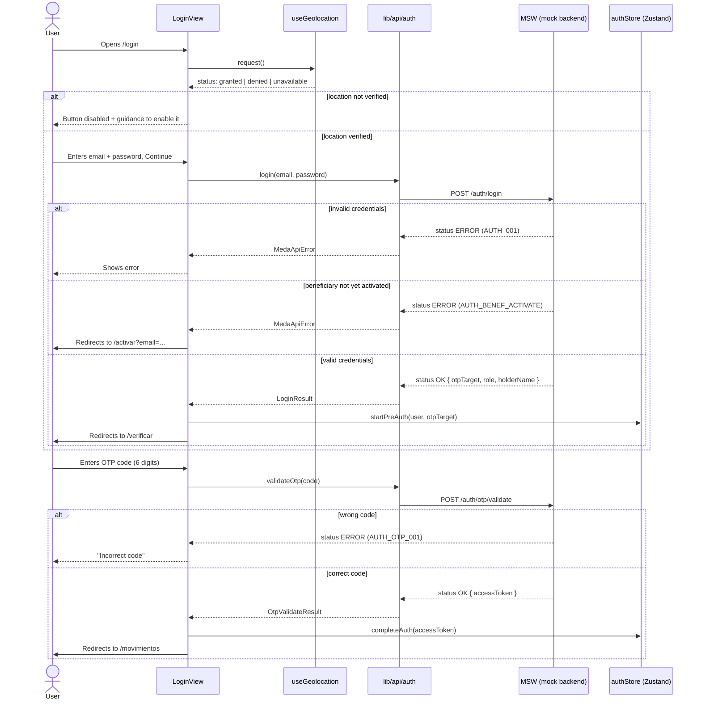
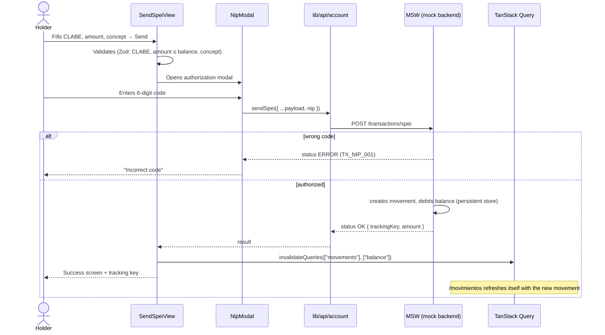
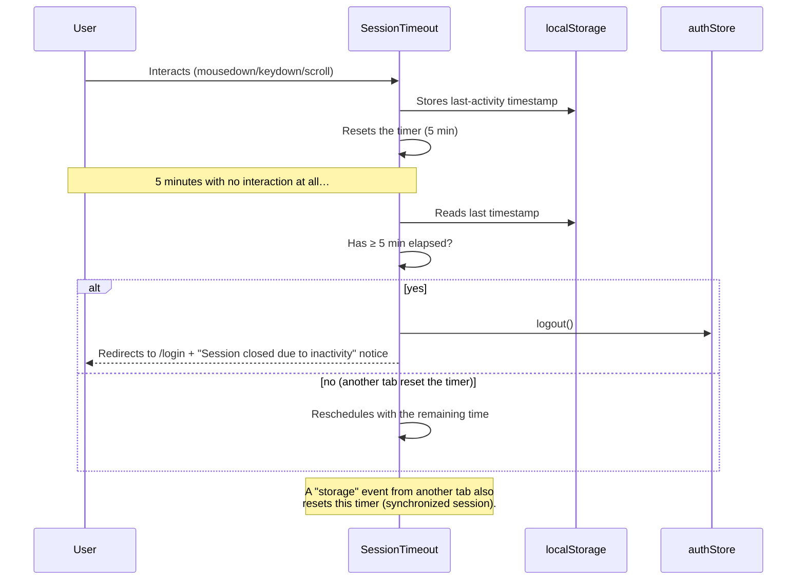

# Medá · Natural Person Web Platform

Digital banking web platform for **natural persons (personas físicas)** at Medá: two-factor login,
balance and movements, SPEI transfers, downloadable PDF account statements, profile management, and a
regulatory **beneficiary and succession** flow (account inheritance on the holder's death).

Built following Medá's frontend standards (Next.js 16 App Router + TypeScript + Tailwind), with
**MSW** simulating the backend while the real endpoints don't exist yet.

> This document explains what the platform does, how it's built, the architecture and security
> decisions behind it, and how to run and test it end to end.

---

## Table of contents

1. [Tech stack](#1-tech-stack)
2. [Getting started](#2-getting-started)
3. [Available scripts](#3-available-scripts)
4. [Environment variables](#4-environment-variables)
5. [Project architecture](#5-project-architecture)
6. [Mocking with MSW: how and why](#6-mocking-with-msw-how-and-why)
7. [API contract (Medá envelope)](#7-api-contract-medá-envelope)
8. [State and data](#8-state-and-data)
9. [Security and best practices applied](#9-security-and-best-practices-applied)
10. [Use cases](#10-use-cases)
11. [Sequence diagrams](#11-sequence-diagrams)
12. [Test credentials](#12-test-credentials)
13. [Sharing a review link (tunnel)](#13-sharing-a-review-link-tunnel)
14. [When the real backend arrives](#14-when-the-real-backend-arrives)

---

## 1. Tech stack

| Layer | Choice | Why |
|---|---|---|
| Framework | **Next.js 16** (App Router, Turbopack) | Medá standard; Server/Client Components, folder-based routing |
| Language | **TypeScript** (`strict: true`) | End-to-end typing across API, forms, and store — no `any` in product code |
| Styling | **Tailwind CSS 4** + MEDA UI tokens (`meda-tokens.css`) | Binance-style design system, native dark mode |
| Forms | **React Hook Form + Zod** | Declarative, typed validation via `@hookform/resolvers` |
| Session state | **Zustand** (`persist` in `sessionStorage`) | Small global state; see [section 8](#8-state-and-data) |
| Remote data | **TanStack Query** | Cache, invalidation, consistent loading/error states |
| Mocking | **MSW (Mock Service Worker)** | Intercepts at the network layer; see [section 6](#6-mocking-with-msw-how-and-why) |
| Icons | **lucide-react** | Icon set consistent with the rest of Medá's apps |
| Package manager | **pnpm**, pinned via `packageManager: "pnpm@11.8.0"` | Reproducibility; exact dependency versions, no `^`/`~` |

## 2. Getting started

```bash
pnpm install

# Development (MSW is on by default in dev)
pnpm dev
# → http://localhost:3000
```

When the app opens in development, MSW starts automatically (zero configuration) and the whole
platform runs against simulated data: no backend, database, or environment variables are needed to
try it locally.

## 3. Available scripts

| Script | What it does |
|---|---|
| `pnpm dev` | Development server (Turbopack), with hot reload |
| `pnpm build` | Production build (server mode) |
| `pnpm start` | Serves the production build (run `pnpm build` first) |
| `pnpm lint` | ESLint across the whole project |
| `pnpm dev:tunnel` | Exposes `localhost:3000` via `cloudflared` — see [section 13](#13-sharing-a-review-link-tunnel) |

## 4. Environment variables

No `.env` file is required to develop: the defaults already enable MSW in dev and point to an empty
API base (every request is intercepted by the mock). Documented for when they're needed:

| Variable | Effective default | Use |
|---|---|---|
| `NEXT_PUBLIC_API_URI_BASE` | `""` (empty) | Prefix for real API routes (`lib/api/client.ts`). Left empty, routes are relative and MSW still intercepts them. |
| `NEXT_PUBLIC_ENABLE_MSW` | `true` in dev, `false` in production | Forces MSW on/off. An explicit `"true"` enables it even in a production build (used for review/demo builds without a backend). An explicit `"false"` disables it in dev. |

**No variable holds a secret.** See [section 9](#9-security-and-best-practices-applied).

## 5. Project architecture

```
src/
├── app/                          # Next.js App Router — routing and layouts only
│   ├── login/                    # /login (public)
│   ├── verificar/                # /verificar — OTP step after login
│   ├── activar/                  # /activar — beneficiary onboarding
│   ├── sucesion/                 # /sucesion — activates the succession protocol (external URL)
│   ├── restablecer/              # /restablecer — resets the mock state (dev/demo only)
│   └── (app)/                    # AUTHENTICATED route group (sidebar + topbar)
│       ├── layout.tsx            #   session guard + AppShell + SessionTimeout
│       ├── movimientos/
│       ├── estados-de-cuenta/[id]/
│       ├── transacciones/{enviar-spei,recibir-spei,entre-cuentas}/
│       ├── perfil/
│       ├── beneficiario/
│       ├── cancelar/
│       └── notificaciones/
│
├── features/                     # Domain logic and UI (one feature = one folder)
│   ├── auth/                     #   login, OTP, beneficiary onboarding, succession
│   ├── movements/                #   movements table, detail, CEP receipt
│   ├── transactions/              #   send SPEI, between-accounts transfer, NIP modal
│   ├── account-statements/       #   listing + printable document (PDF)
│   ├── profile/                  #   view/edit data, change NIP
│   ├── beneficiary/               #   beneficiary create/edit/revoke
│   ├── account/                  #   account cancellation
│   ├── security/                 #   reusable NipDialog (authorization)
│   └── shell/                    #   user menu, notifications, inactivity monitor
│
├── components/
│   ├── ui/                       # MEDA UI library (Button, DataTable, DetailModal, Sidebar, …)
│   ├── providers/                # MSWProvider, QueryProvider, AppProviders
│   └── icons/
│
├── lib/
│   ├── api/                      # Typed clients per domain (auth.ts, account.ts, profile.ts, client.ts)
│   ├── hooks/                    # TanStack Query hooks (use-account.ts, use-profile.ts)
│   ├── stores/                   # Zustand (auth-store.ts)
│   └── utils/                    # format, validators, mask, cn
│
├── mocks/                        # MSW — the simulated backend
│   ├── handlers/                 #   auth.ts, account.ts, profile.ts (one per domain)
│   ├── data.ts                   #   seed data + generators
│   ├── store.ts                  #   persistent mutable state (localStorage)
│   └── browser.ts / enabled.ts   #   worker bootstrap + activation flag
│
└── styles/                       # meda-tokens.css (design tokens), transitions.css
```

**Golden rule:** `app/` only routes (thin pages that render a `features/` component); all business
logic, local state, and composed UI lives in `features/`. This lets the same view be reused from
different routes and keeps it testable in isolation.

## 6. Mocking with MSW: how and why

The natural-person backend **doesn't exist yet**. Instead of hardcoding responses inside components
(`if (fake) return {...}`), the app uses **MSW (Mock Service Worker)**, which intercepts requests **at
the network layer** — application code calls the real route (`/auth/login`, `/account/movements`, …)
with no awareness that a mock exists:

```
Component → hook (TanStack Query) → lib/api/*.ts (fetch to the real route)
                                            │
                                 (dev/demo only) MSW intercepts here, in the browser
                                            │
                                 responds with the same contract the real backend will return
```

**Why it matters:** once the backend is ready, MSW is turned off with one environment variable
(`NEXT_PUBLIC_ENABLE_MSW=false`) and **not a single line of `lib/api` or any component changes** —
mock code never lived mixed into production code that would need to be found and deleted.

**Where each piece lives:**
- `src/mocks/handlers/*.ts` — one file per domain (`auth`, `account`, `profile`), each with its
  `http.get/post/patch/delete` handlers, returning the real [envelope](#7-api-contract-medá-envelope).
- `src/mocks/data.ts` — seed data (167 generated movements, bank catalog, default profile) and
  generator functions for new movements (e.g. when a SPEI transfer is sent).
- `src/mocks/store.ts` — the only place holding **mutable state**: persisted to `localStorage`
  (`meda-pf-mock-state`) so decisions like "activate succession" or "register a beneficiary"
  **survive a page refresh** and behave like real changes, not a UI-only animation.
- `src/components/providers/msw-provider.tsx` — starts the browser's service worker before the app
  renders (prevents a request from firing before the mock is ready) and never leaves the UI stuck if
  the worker fails to start.

**Currently simulated endpoints:**

| Domain | Method & route | What it does |
|---|---|---|
| Auth | `POST /auth/login` | Validates credentials (holder or beneficiary), triggers OTP |
| Auth | `POST /auth/otp/request` | Resends the code |
| Auth | `POST /auth/otp/validate` | Confirms the OTP → issues session tokens |
| Auth | `POST /auth/nip/validate` | Authorizes a sensitive action with the current 6-digit code |
| Auth | `POST /auth/nip/change` | Changes the NIP (validates the current one) |
| Auth | `POST /auth/beneficiary/start` | Onboarding: validates beneficiary eligibility, sends OTP |
| Auth | `POST /auth/beneficiary/activate` | Onboarding: sets password + NIP → session |
| Auth | `POST /auth/logout` | Signs out |
| Account | `GET /account/balance` | Balance and account data |
| Account | `GET /account/movements` | Movements with filters (tracking key, date range) |
| Account | `GET /account/movements/:id` | Movement detail |
| Account | `GET /account/movements/:id/cep` | Electronic Payment Receipt (CEP) |
| Account | `GET /account/statements` | Available account-statement periods |
| Account | `POST /transactions/spei` | Sends a SPEI transfer (requires NIP), creates a new movement |
| Profile | `GET /account/profile` | Profile + account status + beneficiary list |
| Profile | `PATCH /account/profile` | Updates email/phone/RFC |
| Beneficiary | `GET / POST /account/beneficiary` | List / create beneficiaries |
| Beneficiary | `PATCH /account/beneficiary/:id` | Edit |
| Beneficiary | `DELETE /account/beneficiary/:id` | Revoke |
| Succession | `POST /account/succession/request` | Activates the protocol via the holder's email (external flow) |
| Account | `POST /account/cancel` | Cancels the account (requires NIP + destination CLABE) |
| Demo | `POST /demo/reset` | Resets the mock state to its initial values |

## 7. API contract (Medá envelope)

Every call uses the same envelope (`lib/api/client.ts`), matching Medá's Java services:

```ts
// Request (POST/PATCH/DELETE)
{ "traceId": "generated-uuid", "body": { /* payload */ } }

// Response
{ "status": "OK" | "ERROR", "errorCode": string | null, "errorMessage": string | null, "data": T }
```

`get/post/patch/del` in `lib/api/client.ts` unwrap the response automatically: when
`status === "ERROR"` they throw `MedaApiError(errorCode, errorMessage)`, which components catch to
show the message to the user. **HTTP status is never used to decide success/failure** — Medá returns
**HTTP 200 with `status: "ERROR"`** for business errors (invalid credentials, wrong NIP, etc.), and
reserves `>= 500` for infrastructure failures.

## 8. State and data

- **User session** → Zustand (`lib/stores/auth-store.ts`), persisted to `sessionStorage` (cleared when
  the tab/browser closes, not `localStorage`, so a session never lingers indefinitely on a shared
  device). Holds `preAuth` (credentials validated, awaiting OTP) and `user` (full session),
  distinguishing role `HOLDER` vs `BENEFICIARY`.
- **Remote data** (balance, movements, profile, statements) → TanStack Query. Every relevant mutation
  (sending a SPEI, updating the profile, registering a beneficiary) invalidates the affected queries
  (`["balance"]`, `["movements"]`, `["profile"]`) so the UI refreshes itself, with no hand-rolled
  duplicate state.
- **No Redux**: this app's global-state surface (session + network cache) doesn't justify it; Zustand
  + TanStack Query cover 100% of the cases. See the `fe-state-management` standard.

## 9. Security and best practices applied

A verified checklist against this repository's actual code — not aspirational.

### Client-side security
- **No secrets in client code.** The only `NEXT_PUBLIC_*` variables are public configuration (API base
  URL, mocking flag) — never tokens or keys.
- **No `console.*`** in product code — confirmed by repo-wide grep; the only matches live in the
  `/showcase` and `/components` reference pages that document the internal UI library and are not part
  of the business flow.
- **No `any` / `as any`** anywhere in application code, enforced by `"strict": true` in
  `tsconfig.json`. Every API response, form value, and store shape is typed end to end.
- **`dangerouslySetInnerHTML`** used exactly once, in `src/app/layout.tsx`, to inject a **static string
  literal** (dark/light theme detection before first paint) that contains no user input, no network
  response, and no interpolated data — it cannot be an XSS vector.
- **No `eval`, `Function()`, or dynamic script injection** anywhere in the codebase.

### Input validation
All forms are validated with **Zod** schemas before submission (login, SPEI transfer, beneficiary,
profile). Domain-specific validators live in `lib/utils/validators.ts` and are reused everywhere the
same data type appears, instead of being redefined per form:

| Field | Rule | Regex |
|---|---|---|
| CLABE | exactly 18 digits | `/^\d{18}$/` |
| RFC (person or entity) | format only, not SAT-validated | `/^[A-ZÑ&]{3,4}\d{6}[A-Z\d]{3}$/i` |
| CURP | 18 characters, format only | `/^[A-Z]{4}\d{6}[HM][A-Z]{5}[A-Z\d]\d$/i` |
| Mexican phone | exactly 10 digits | `/^\d{10}$/` |
| Email | basic shape check | `/^[^\s@]+@[^\s@]+\.[^\s@]+$/` |
| OTP / authorization code | exactly 6 numeric digits | enforced by the `InputOTP` component (`length={6}`) |

Numeric-only fields (CLABE, phone, reference number) strip non-digit characters on every keystroke
instead of only validating on submit, so the user can never type a letter into a CLABE field.

### Sensitive-action authorization
Every action below requires the user to enter the **6-digit authorization code** before it executes —
none of them fire on a single click. The table maps each action to where it's enforced and the mock
error code returned on failure:

| Action | UI component | Backend route | Error code on failure |
|---|---|---|---|
| Send a SPEI / between-accounts transfer | `features/transactions/nip-modal.tsx` | `POST /transactions/spei` | `TX_NIP_001` |
| Change email | `features/profile/profile-view.tsx` (`ChangeEmailModal`) | `PATCH /account/profile` (via `NipDialog`) | `NIP_001` |
| Change phone | `features/profile/profile-view.tsx` (`ChangePhoneModal`) | `PATCH /account/profile` (via `NipDialog`) | `NIP_001` |
| Change the NIP itself | `features/profile/profile-view.tsx` (`ChangeNipModal`) | `POST /auth/nip/change` | `NIP_002` (wrong current NIP) |
| View / download an account statement | `features/account-statements/statements-view.tsx` | `POST /auth/nip/validate` | `NIP_001` |
| Register / edit / revoke a beneficiary | `features/beneficiary/beneficiary-view.tsx` (via `NipDialog`) | `POST` / `PATCH` / `DELETE /account/beneficiary` | `NIP_001` |
| Cancel the account | `features/account/cancel-account-view.tsx` | `POST /account/cancel` | `NIP_001`, then `CANCEL_001` if the destination CLABE is invalid |

The authorization dialog (`features/security/nip-dialog.tsx`) is a single reusable component so every
flow enforces the same UX and the same failure handling — there's no place in the app that re-invents
"ask for the code."

### Session handling
- Session tokens live in `sessionStorage`, not `localStorage`, so they never survive closing the
  browser tab. This is a **mock token today** (no real backend to authenticate against); when the real
  backend ships, see the migration note in [section 14](#14-when-the-real-backend-arrives) — the plan
  is to move to an httpOnly cookie issued by the server, per Medá's `fe-auth` standard, since a
  client-readable token is an XSS exfiltration target.
- **Automatic logout after 5 minutes of inactivity** (`features/shell/session-timeout.tsx`), a
  regulatory requirement (IFPE). Tracks `mousedown`, `mousemove`, `keydown`, `scroll`, `touchstart`;
  synchronizes across browser tabs via the `storage` event so activity in one tab resets the timer in
  every other open tab, and re-checks elapsed time on `visibilitychange` so a backgrounded tab can't
  silently outlast the timeout.
- **Role-aware session guard**: the `(app)` layout redirects to `/login` whenever `isAuthenticated` is
  false, and the beneficiary role (`BENEFICIARY`) is carried in the session so the UI can show the
  "accessing via succession" banner without a second round-trip.

### Regulatory gate: geolocation
Login is blocked until location is verified (IFPE requirement — see
[use case 10](#use-case-10--mandatory-geolocation-at-login)). The check uses the **Permissions API**
first (`navigator.permissions.query({ name: "geolocation" })`) rather than trusting
`getCurrentPosition` alone, specifically to avoid a false "blocked" state when the browser permission
is granted but the OS-level location service is off (a common macOS scenario) — in that case the user
is still let through, since the *permission* (the thing actually within the user's/regulator's
control) is what's being verified.

### Dependency and build hygiene
- **Exact dependency versions** (no `^`/`~`) in `package.json`, plus a committed `pnpm-lock.yaml` — a
  transitive dependency never bumps silently on `pnpm install`.
- **`packageManager` pinned** (`pnpm@11.8.0`) for reproducibility across machines and CI.
- **MSW never runs in production** unless explicitly forced on (only used for backend-less
  demo/review builds), and its code lives entirely outside `lib/api` and the components — see
  [section 6](#6-mocking-with-msw-how-and-why). The activation check
  (`src/mocks/enabled.ts`) hard-codes `NODE_ENV === "production"` as a fallback deny, so a missing or
  misconfigured environment variable fails closed, not open.

### Accessibility
Form errors are rendered next to their field (not only as a toast), interactive elements without
visible text carry `aria-label` (copy buttons, modal close, menus), focus rings are preserved (never
suppressed with `outline: none`), and status is never conveyed by color alone (e.g. `StatusPill` pairs
a colored dot with a text label).

## 10. Use cases

#### Use case 1 — Two-factor login
The holder enters email and password. If valid, a **one-time code is emailed** (OTP); only after
confirming it is the session granted. Without a verified location, the login button stays disabled
(see use case 10).

#### Use case 2 — Browsing movements with filters
The holder sees their balance, the total record count, and a movements table filterable by **tracking
key** and **date range**. Each row offers **View detail** (a modal with sender/receiver, commission,
VAT) and, from there, **View CEP** (the receipt with its digital stamp) — all without leaving the page.

#### Use case 3 — Sending a SPEI transfer (to a third party or between own accounts)
A form validates the CLABE (18 digits), bank, amount against available balance, and concept. Before the
transfer executes, the **6-digit authorization code** is required. Once confirmed, the movement appears
immediately in the list and the balance updates (query invalidation).

#### Use case 4 — Receiving a SPEI transfer
A screen with the account's banking details (CLABE, bank, holder name) ready to copy and share.

#### Use case 5 — Account statements as PDF
A list of available periods. **View** and **Download** both require the 6-digit code first (sensitive
data). The document renders as a real bank statement (header, deposits/charges summary, full movement
table for the period), and "Download" triggers the browser's native print dialog targeting "Save as
PDF" — no PDF-generation library involved.

#### Use case 6 — Profile: viewing and editing data
The holder sees their information (email, phone, RFC, CURP, CLABE) and can **change email, phone, or
NIP**, each change authorized with the 6-digit code (or the current NIP, when changing the NIP itself).

#### Use case 7 — Multiple beneficiaries and the succession protocol
The centerpiece of regulatory compliance: if the holder dies, their funds must pass to whoever they
designated, without the account being left orphaned.

- The holder can register **more than one beneficiary**, splitting a **percentage** that can never add
  up to more than 100% across all of them.
- Adding, editing, or revoking a beneficiary requires the 6-digit code.
- The succession protocol is activated from an **external URL** (`/sucesion`), not from inside the
  holder's session — modeling the real-world fact that whoever reports a death doesn't hold the
  holder's credentials. Entering the holder's email, the system validates that active beneficiaries
  exist and closes the holder's account.
- Each active beneficiary then goes through their **own onboarding** (`/activar`): since they never had
  a password, they verify their email (OTP), create their password and their NIP, and from then on can
  log in with their own credentials to view/operate the inherited account.
- Once succession is activated, the original holder **can no longer log in** (an explicit message, not
  a generic error).

#### Use case 8 — Canceling the account
From the profile, the holder can request cancellation: they specify which CLABE to disperse their
balance to, confirm with the 6-digit code, and the account is marked as canceled (login blocked from
that point on).

#### Use case 9 — Session timeout on inactivity
For compliance (IFPE), the session closes automatically after **5 minutes with no activity** (mouse,
keyboard, scroll, touch). Synchronized across tabs in the same browser: activity in one tab resets the
timer in the others, and returning focus to a tab re-checks whether the timeout already elapsed while
it was in the background.

#### Use case 10 — Mandatory geolocation at login
A regulatory requirement: login is not possible without a verified location. The UI clearly
distinguishes **blocked** (the user denied the permission: they're shown how to re-enable it in the
browser) from **unavailable** (the site permission is granted but the operating system isn't returning
coordinates — common on macOS with Location Services turned off: in that case, if the **permission**
is granted, the user is allowed through even without exact coordinates, so an OS-level limitation never
blocks access). When location moves from blocked to verified, a brief banner appears and fades on its
own — it never shows if location was already enabled beforehand.

---

## 11. Sequence diagrams

### 11.1 Login + OTP verification



### 11.2 Sending a SPEI transfer with authorization



### 11.3 Succession protocol and beneficiary activation

```mermaid
sequenceDiagram
    actor R as Reporter (external URL)
    actor B as Beneficiary
    participant SU as /sucesion
    participant API as lib/api/profile
    participant MSW as MSW (mock backend)
    participant AC as /activar

    R->>SU: Opens /sucesion, enters the holder's email
    SU->>API: requestSuccession(email)
    API->>MSW: POST /account/succession/request
    alt no active beneficiaries
        MSW-->>SU: status ERROR (SUCC_002)
    else has active beneficiaries
        MSW->>MSW: accountStatus = DECEASED (persisted)
        MSW-->>SU: status OK { holderName, beneficiaries[] }
        SU-->>R: List of beneficiaries with an "Activate →" link
    end

    R->>B: Shares /activar?email=beneficiary@example.com
    B->>AC: Opens the link
    AC->>API: beneficiaryStart(email)
    API->>MSW: POST /auth/beneficiary/start
    MSW-->>AC: status OK { otpTarget } (sends OTP)
    B->>AC: Confirms OTP
    B->>AC: Creates password + NIP
    AC->>API: beneficiaryActivate(email, password, nip)
    API->>MSW: POST /auth/beneficiary/activate
    MSW->>MSW: beneficiary.activated = true; stores credentials
    MSW-->>AC: status OK { accessToken, role: BENEFICIARY }
    AC-->>B: Session started → /movimientos ("accessing via succession" banner)

    Note over MSW: From here on, the original holder gets<br/>AUTH_DECEASED when trying to log in.
```

### 11.4 Session timeout on inactivity



---

## 12. Test credentials

To explore the platform without a real backend, values live in `src/mocks/data.ts`:

| Value | Data |
|---|---|
| Holder email | `saul.franco+01@meda.com.mx` |
| Holder password | `Meda2026!` |
| OTP code (login, activation) | `123456` |
| Authorization code (NIP, 6 digits) | `123456` |

Suggested flow to test the full succession cycle:

1. Log in as the holder → Profile → Beneficiary → add one or more beneficiaries (code `123456`,
   splitting the percentage).
2. Open `/sucesion` (in another tab, or after logging out) → enter the holder's email.
3. Follow a beneficiary's "Activate →" link → complete onboarding at `/activar`.
4. Confirm the holder can no longer log in (account-closed message).
5. To reset the state and start over: open **`/restablecer`**.

## 13. Sharing a review link (tunnel)

```bash
pnpm dev          # in one terminal
pnpm dev:tunnel   # in another
```

`dev:tunnel` exposes `localhost:3000` through `cloudflared` and prints a temporary public URL
(`*.trycloudflare.com`). This lets a reviewer open the platform without installing anything locally —
it serves the same dev build running on your machine, with MSW answering every request.

## 14. When the real backend arrives

1. Confirm the real routes match the ones listed in [section 6](#6-mocking-with-msw-how-and-why) (or
   update `lib/api/*.ts` if they differ).
2. Set `NEXT_PUBLIC_API_URI_BASE` to the service URL.
3. Set `NEXT_PUBLIC_ENABLE_MSW=false` in the target environment (or simply leave it unset in
   production, which is already the safe default).
4. No other change is required: `lib/api`, the TanStack Query hooks, and the components never imported
   anything from `src/mocks/` — they simply stop being used.
5. Move the `accessToken` from `sessionStorage` to an **httpOnly cookie** issued by the backend (today
   it's a simulated value with no real use; Medá's security standard favors httpOnly cookies over
   client-side storage for sensitive tokens).
